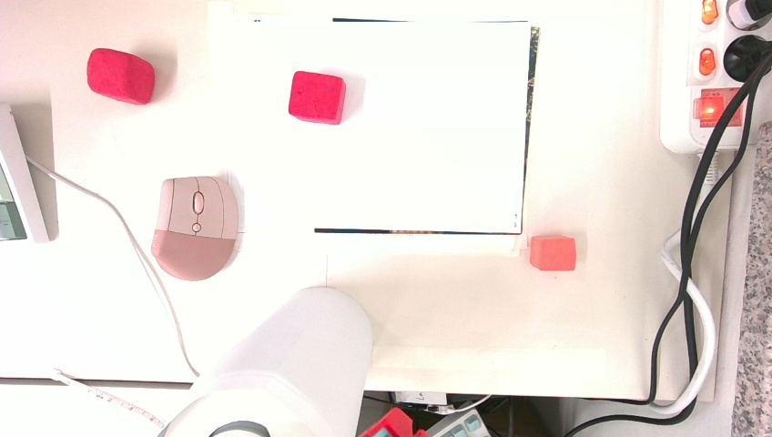

# vision-manipulator

## 🤖 Vision Manipulator

> **Vision + Robot Arm 통합 시스템 개발 프로젝트**  
> YOLO 기반 객체 탐지, 키포인트 추출, 좌표 변환, Grasp 수행까지 이어지는 end-to-end 로봇 비전 자동화 시스템입니다.

---

## 📌 프로젝트 개요

이 프로젝트는 **컴퓨터 비전 기반 로봇 팔 자동화 시스템**으로, 주요 기능은 다음과 같습니다:

- 🔍 **YOLOv11 기반 객체 탐지**
- 🧠 **LLM 기반 자연어 명령 해석**
- 📐 **Keypoint → 3D 좌표 변환**
- 🤖 **로봇 팔 제어 (Eye-in-Hand 구조)**
- 📷 **RGB-D 이미지 캡처 및 Calibration**
- 📊 **기하 기반 Surface Normal 분석**

---

### 🗂️ 디렉토리 구조

```bash
vision-manipulator/
├── data/              # 캡처 이미지, Calibration Data,예제 영상
├── notebooks/         # 분석용 Jupyter 노트북
├── prompt/            # LLM 프롬프트 예시
├── utils/             # 보조 함수 모음 (좌표 변환 등)
├── main_executor.py   # 메인 실행 코드
├── README.md
└── .gitignore
```

---

## 🚀 주요 기능 설명

| 기능                          | 설명                                        |
| --------------------------- | ----------------------------------------- |
| **Vision 기반 객체 인식**         | YOLOv11 fine-tuning 모델로 실시간 탐지            |
| **좌표 변환**                   | 2D keypoint → 3D 카메라 좌표 → 로봇 베이스 좌표       |
| **Eye-in-Hand Calibration** | 카메라→그리퍼 변환 행렬 계산 (`cv2.calibrateHandEye`) |
| **자연어 명령 처리**               | GPT 기반 LLM으로 자연어를 명령어로 해석                 |
| **Grasp 제어**                | 예측된 위치 기반 로봇팔 Pick & Place 동작 수행          |

---

## 🧪 예시 이미지

| RGB 이미지                       | 탐지 결과                           | 3D 위치                           |
| ----------------------------- | ------------------------------- | ------------------------------- |
|  |  |  |


```