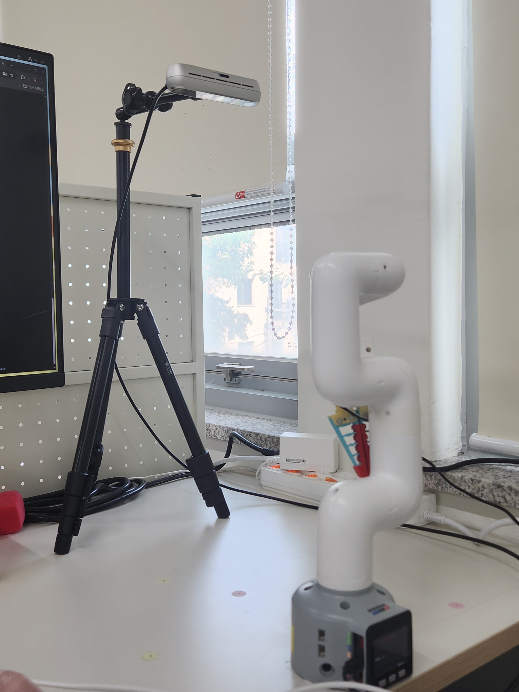
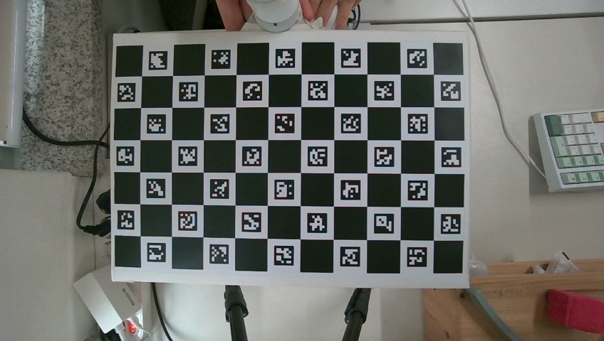
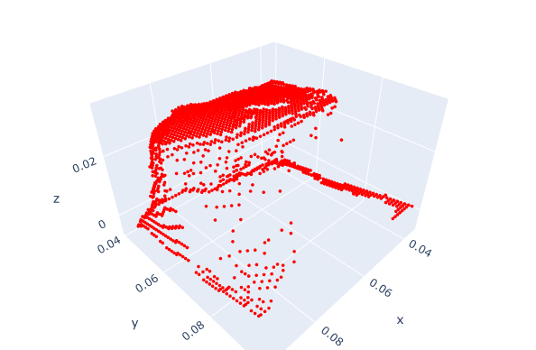
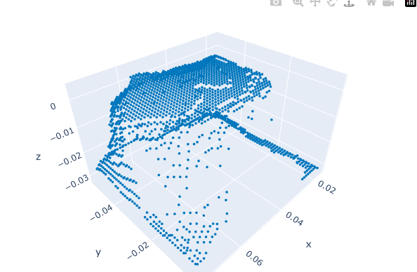

# vision-manipulator

> **Vision + Robot Arm 통합 시스템 개발 프로젝트**  \
> YOLO 기반 객체 탐지, 키포인트 추출, 좌표 변환, Grasp 수행까지 이어지는 end-to-end 로봇 비전 자동화 시스템입니다.

<br>

## 프로젝트 개요

이 프로젝트는 **컴퓨터 비전 기반 로봇 팔 자동화 시스템**으로, 주요 기능은 다음과 같습니다:

- **YOLOv11 기반 객체 탐지**
- **LLM 기반 자연어 명령 해석**
- **Keypoint → 3D 좌표 변환**
- **로봇 팔 제어 (Eye-in-Hand 구조)**
- **RGB-D 이미지 캡처 및 Calibration**
- **기하 기반 Surface Normal 분석**

<br>

### 디렉토리 구조

```bash
vision-manipulator/
├── data/              # 캡처 이미지, Calibration Data,예제 영상
├── notebooks/         # 분석용 Jupyter 노트북
├── prompt/            # LLM 프롬프트 예시
├── utils/             # 보조 함수 모음 (좌표 변환 등)
├── main_executor.py   # 메인 실행 코드
├── README.md
└── .gitignore
```

<br>

## 주요 기능
<table align="center" style="text-align: center;">
  <thead>
    <tr>
      <th><b>기능</b></th>
      <th><b>설명</b></th>
    </tr>
  </thead>
  <tbody>
    <tr>
      <th><b>Vision 기반 객체 인식</b></th>
      <th>YOLOv11 fine-tuning 모델로 실시간 탐지</th>
    </tr>
    <tr>
      <th><b>좌표 변환</b></th>
      <th>2D keypoint → 3D 카메라 좌표 → 로봇 베이스 좌표</th>
    </tr>
    <tr>
      <th><b>Eye-in-Hand Calibration</b></th>
      <th>카메라→그리퍼 변환 행렬 계산 (`cv2.calibrateHandEye`)</th>
    </tr>
    <tr>
      <th><b>자연어 명령 처리</b></th>
      <th>GPT 기반 LLM으로 자연어를 명령어로 해석</th>
    </tr>
    <tr>
      <th><b>Grasp 제어</b></th>
      <th>예측된 위치 기반 로봇팔 Pick & Place 동작 수행</th>
    </tr>
  </tbody>
</table>

<br>

## 환경 세팅
<table align="center" style="text-align: center;">
  <thead>
    <tr>
      <th><b>Eye‑to‑Hand Environment</b></th>
      <th><b>Calibration target(Camera View)</b></th>
    </tr>
  </thead>
  <tbody>
    <tr>
      <td>
        
      </td>
      <td>
        
      </td>
    </tr>
  </tbody>
</table>

* **사용 하드웨어**
  * **Intel RealSense D455** \
    : Depth sensing 및 RGB 이미지 동시 수집을 위한 RGB-D 카메라. \
    : 카메라는 로봇의 외부에 Eye-to-Hand 방식으로 고정됨.
  * **Elephant Robotics MyCobot 280 M5** \
    : ROS2 호환 소형 로봇팔

* **통합 시스템 구성**
  * 카메라 → Depth + RGB 이미지 취득
  * ROI 추출 및 포인트클라우드 생성
  * Surface normal + PCA 기반 RPY 자세 추정
  * 추정된 6-DoF → 로봇 베이스 좌표계로 변환하여 pick pose 결정

* **기술 스택**
  * OS: Ubuntu 22.04
  * ROS: ROS2 Humble
  * Vision: OpenCV, Open3D
  * Detection: YOLOv11 기반 커스텀 객체 탐지


<br>

## 2. Hand-Eye Calibration 오차 분석
Eye-to-Hand 환경에서 **Tsai–Lenz 알고리즘 기반 초기 변환 행렬**을 구한 뒤,  
후처리 단계를 통해 **회전(R)과 병진(t) 오차를 단계적으로 줄이는 방식**을 적용하였다.  

최종적으로는 **Pose Graph Optimization(PGO) + Inlier Filtering**으로 보정된  
`cam2base` 변환 행렬을 사용한다.
<br>
### 2.1 단계별 보정 절차

1. **초기 추정 (Tsai–Lenz)**  
   - Charuco 보드 인식 기반으로 초기 \(R_{cam→base}, t_{cam→base}\) 계산  
   - 기본 정합은 가능하지만, 회전·병진 오차가 크게 남음

2. **회전 보정 (Table Normal Fix)**
   - Depthmap 평면 분할을 통해 테이블 법선 벡터 추정  
   - 초기 회전 행렬의 Roll/Pitch 기울기를 보정하여  
     로봇–테이블 정렬 기준의 안정성을 확보
     
<table align="center" style="text-align: center;">
  <thead>
    <tr>
      <th><b>구분</b></th>
      <th><b>보정 전(Camera View)</b></th>
      <th><b>보정 후</b></th>
    </tr>
  </thead>
  <tbody>
    <tr>
      <th>이미지</th>
      <td>
        
      </td>
      <td>
        
      </td>
    </tr>
    <tr>
      <th><b>camera PRY</b></th>
      <th><b> (1.460, 2.320, 93.034) [deg] </b></th>
      <th><b>(1.460, 2.320, 93.034) [deg] </b></th>
    </tr>
    <tr>
      <th><b>Base PRY</b></th>
      <th><b> (-168.07, -1.675, -2.52) [deg] </b></th>
      <th><b> (-178.820, -0.69, -3.03) [deg] </b></th>
    </tr>
  </tbody>
</table>
  
  <table align="center" style="text-align: center;">
    <thead>
      <tr>
        <th><b구분</b></th>
        <th><b>보정 전 오차 [deg]</b></th>
        <th><b>보정 후 오차 [deg]</b></th>
        <th><b>개선률</b></th>
      </tr>
    </thead>
    <tbody>
      <tr>
        <th><b>Roll</b></th>
        <th><b>11.93</b></th>
        <th><b>1.18</b></th>
        <th><b>90.11%</b></th>
      </tr>
      <tr>
        <th><b>Pitch</b></th>
        <th><b>1.675</b></th>
        <th><b>0.69</b></th>
        <th><b>58.81%</b></th>
      </tr>
    </tbody>
  </table>


3. **최종 최적화 (PGO with inlier filtering)**  
   - AX=XB 형태의 Pose Graph Optimization 적용  
   - MAD 기반 inlier filtering으로 외란 프레임 제거  
   - 결과적으로 **평균 회전 오차 ~0.9°, 평균 병진 오차 ~3 mm** 수준 달성

<br>

### 2.2 최종 성능

<table align="center" style="text-align: center;">
  <thead>
    <tr>
      <th><b>Rotation Comparison Plot(Camera View)</b></th>
      <th><b>translation Comparison Plot</b></th>
    </tr>
  </thead>
  <tbody>
    <tr>
      <td>
        
      </td>
      <td>
        
      </td>
    </tr>
  </tbody>
</table>

<table align="center" style="text-align: center;">
  <thead>
    <tr>
      <th><b>항목</b></th>
      <th><b>보정 전 (초기)</b></th>
      <th><b>Table Normal Fix 후</b></th>
      <th><b>PGO 최적화 후</b></th>
    </tr>
  </thead>
  <tbody>
    <tr>
      <th><b>회전 오차 (mean)</b></th>
      <th><b>8°이상</b></th>
      <th><b>1–2° 수준 </b></th>
      <th><b> ~0.9°</b></th>
    </tr>
    <tr>
      <th><b>병진 오차 (mean)</b></th>
      <th><b>6~8cm</b></th>
      <th><b>6~8cm</b></th>
      <th><b>~3 mm</b></th>
    </tr>
  </tbody>
</table>

- Table Normal Fix로 **Roll/Pitch 오차는 크게 줄었지만**,  
  **병진 오차는 여전히 수 cm 수준** 남음  
- PGO_inlier 최적화 적용 후, **XYZ 오차가 수 mm 수준으로 안정화**  
- Pick & Place 작업에서 요구되는 정밀도에 부합


### 2.3 분석

- **단일 테이블 평면**만으로는 XY 제약력이 부족 → Z 및 Roll/Pitch만 안정화  
- PGO를 통한 전체 Pose Consistency 최적화가 필수  
- Outlier 제거를 병행해야 안정적인 결과 확보 가능  
- 최종 결과는 **실측 값 대비 ±3 mm / ±1° 이내 오차**로 수렴  

<br>

## 3. YOLO 객체 탐지: x,y,z 좌표 추정

| 입력 이미지 | YOLO 탐지 결과 | ROI Depth 결과 |
|-------------|----------------|-----------|
|  |  | |

- 이미지 상 bbox 중심점: **(x, y) = (196, 191)**
- 카메라 좌표계 기준 위치: **(X<sub>cam</sub>, Y<sub>cam</sub>, Z<sub>cam</sub>) = (-0.196, -0.046, 0.355) [m]**
- 로봇 Base 좌표계 변환 결과: **(X<sub>base</sub>, Y<sub>base</sub>, Z<sub>base</sub>) = (189.92, 136.7, -212.6) [mm]**
- ROI 영역은 YOLO Detection 결과를 바탕으로 추출된 bbox로부터 생성됨

<br>

## 4. RPY 자세 추정 (Surface Normal + PCA)
| 단계 | ROI PCD | Surface Normal 시각화 | Yaw 예측 결과 |
| --------------------- | --------------------- | --------------------- | --------------------- |
| **Before** | |  | |
| **After \(RANSAC 후)**  |  |  |  |

- **Roll, Pitch**는 평균 Surface Normal을 기반으로 추정
- **Yaw**는 PCA의 단축(minor axis) 방향을 기반으로 추정
- **RANSAC 기반 평면 분리** 적용 전후 비교:
  - Yaw 오차 개선: 36.25° → 8.06° (77.8% 감소) 

