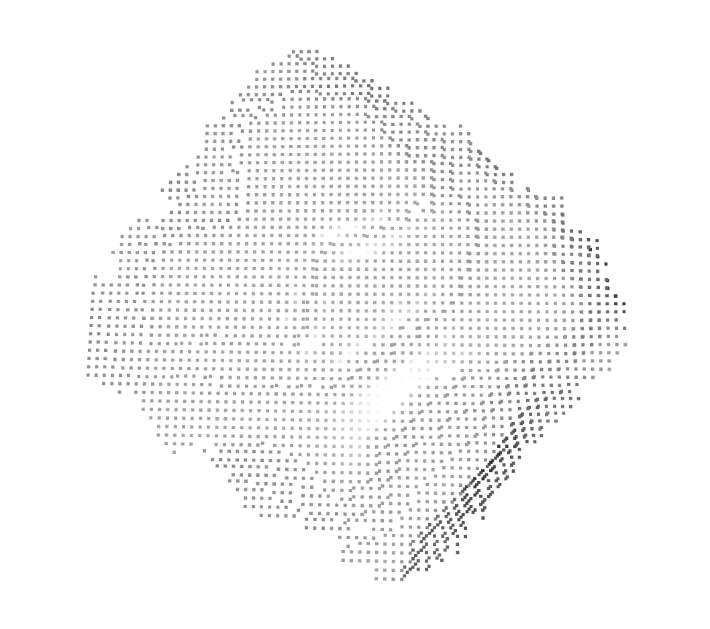

# vision-manipulator

> **Vision + Robot Arm 통합 시스템 개발 프로젝트**  \
> YOLO 기반 객체 탐지, 키포인트 추출, 좌표 변환, Grasp 수행까지 이어지는 end-to-end 로봇 비전 자동화 시스템입니다.

<br>

## 프로젝트 개요

이 프로젝트는 **컴퓨터 비전 기반 로봇 팔 자동화 시스템**으로, 주요 기능은 다음과 같습니다:

- **YOLOv11 기반 객체 탐지**
- **LLM 기반 자연어 명령 해석**
- **Keypoint → 3D 좌표 변환**
- **로봇 팔 제어 (Eye-in-Hand 구조)**
- **RGB-D 이미지 캡처 및 Calibration**
- **기하 기반 Surface Normal 분석**

<br>

### 디렉토리 구조

```bash
vision-manipulator/
├── data/              # 캡처 이미지, Calibration Data,예제 영상
├── notebooks/         # 분석용 Jupyter 노트북
├── prompt/            # LLM 프롬프트 예시
├── utils/             # 보조 함수 모음 (좌표 변환 등)
├── main_executor.py   # 메인 실행 코드
├── README.md
└── .gitignore
```

<br>

## 주요 기능

| 기능                          | 설명                                        |
| --------------------------- | ----------------------------------------- |
| **Vision 기반 객체 인식**         | YOLOv11 fine-tuning 모델로 실시간 탐지            |
| **좌표 변환**                   | 2D keypoint → 3D 카메라 좌표 → 로봇 베이스 좌표       |
| **Eye-in-Hand Calibration** | 카메라→그리퍼 변환 행렬 계산 (`cv2.calibrateHandEye`) |
| **자연어 명령 처리**               | GPT 기반 LLM으로 자연어를 명령어로 해석                 |
| **Grasp 제어**                | 예측된 위치 기반 로봇팔 Pick & Place 동작 수행          |

<br>

## 환경 세팅
<table align="center" style="text-align: center;">
  <thead>
    <tr>
      <th><b>Eye‑in‑Hand 카메라 장착</b></th>
      <th><b>로봇팔 전체 모습</b></th>
    </tr>
  </thead>
  <tbody>
    <tr>
      <td>
        
      </td>
      <td>
        
      </td>
    </tr>
    <tr>
      <td>브래킷 추가 제작 후 End‑Effector에 장착</td>
      <td>depth 정확도 개선을 위한 높이 추가</td>
    </tr>
  </tbody>
</table>

* **사용 로봇 하드웨어**
  * **Intel RealSense D455** \
    : Depth sensing 및 RGB 이미지 동시 수집을 위한 RGB-D 카메라. \
    : 카메라는 로봇의 End-Effector에 Eye-in-Hand 방식으로 고정됨.
  * **Elephant Robotics MyCobot 280 M5** \
    : ROS2 호환 소형 로봇팔로, Eye-in-Hand 구조에서 카메라와 함께 이동하며 물체 탐지 및 정밀 제어 가능. 
  * **125mm 철제 원기둥 추가** \
    : RGB-D 카메라의 깊이 추정 정확도 향상을 위해 End-Effector 아래에 원기둥을 장착. \
    : 평면 기반의 Depth 오류 및 클리핑 문제를 완화하고, 픽 포인트 추정의 안정성 증가.

* **통합 시스템 구성**
  * 카메라 → Depth + RGB 이미지 취득
  * ROI 추출 및 포인트클라우드 생성
  * Surface normal + PCA 기반 RPY 자세 추정
  * 추정된 RPY → 로봇 베이스 좌표계로 변환하여 pick pose 결정

* **기술 스택**
  * OS: Ubuntu 22.04
  * ROS: ROS2 Humble
  * Vision: OpenCV, Open3D
  * Detection: YOLOv10 기반 커스텀 객체 탐지


<br>

## 2. Hand-Eye Calibration 오차 분석
Eye-in-Hand 환경에서 캘리브레이션된 카메라의 외재 파라미터 정밀도를 높이기 위해, \
**기존 Tsai-Lenz 알고리즘 기반 변환 행렬**에 **ICP 기반 후정합**을 적용. \
그림: 오차 분포 시각화 (진한 색: 오차 큼 / 밝은 색: 오차 작음)

|  정확도 식별 실험 환경 | 초기 R,t 결과 | ICP 정합 적용 후 |
|-------------|----------------|--------------------|
|  |  |  |

총 12개 지점에 대해 실험을 수행한 결과, 다음과 같은 **오차 개선**을 확인:
| 구분   | X축 평균 오차 (mm) | Y축 평균 오차 (mm) | 전체 평균 오차 (mm) |
| ---- | ------------- | ------------- | ------------- |
| 정합 전 | 16.97         | 75.95         | **92.92**     |
| 정합 후 | 16.03         | 15.26         | **31.28**     |

* 전체 평균 오차 **66.34% 감소**
* 특히 Y축 오차는 **약 76.5%** 개선됨

> **정합 전 전체 오차**: 92.92 mm \
> **정합 후 전체 오차**: 31.28 mm \
> **오차 개선률**: **66.34%** \
> **Y축 오차 개선률이 두드러짐 (76.46%)** 

<br>

## 3. YOLO 객체 탐지: x,y,z 좌표 추정

| 입력 이미지 | YOLO 탐지 결과 | ROI Depth 결과 |
|-------------|----------------|-----------|
|  |  | |

- 이미지 상 bbox 중심점: **(x, y) = (196, 191)**
- 카메라 좌표계 기준 위치: **(X<sub>cam</sub>, Y<sub>cam</sub>, Z<sub>cam</sub>) = (-0.196, -0.046, 0.355) [m]**
- 로봇 Base 좌표계 변환 결과: **(X<sub>base</sub>, Y<sub>base</sub>, Z<sub>base</sub>) = (189.92, 136.7, -212.6) [mm]**
- ROI 영역은 YOLO Detection 결과를 바탕으로 추출된 bbox로부터 생성됨

<br>

## 4. RPY 자세 추정 (Surface Normal + PCA)
| 단계 | ROI PCD | Surface Normal 시각화 | Yaw 예측 결과 |
| --------------------- | --------------------- | --------------------- | --------------------- |
| **Before** | |  | |
| **After \(RANSAC 후)**  |  |  |  |

- **Roll, Pitch**는 평균 Surface Normal을 기반으로 추정
- **Yaw**는 PCA의 단축(minor axis) 방향을 기반으로 추정
- **RANSAC 기반 평면 분리** 적용 전후 비교:
  - Yaw 오차 개선: 36.25° → 8.06° (77.8% 감소) 

